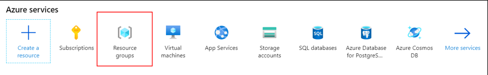
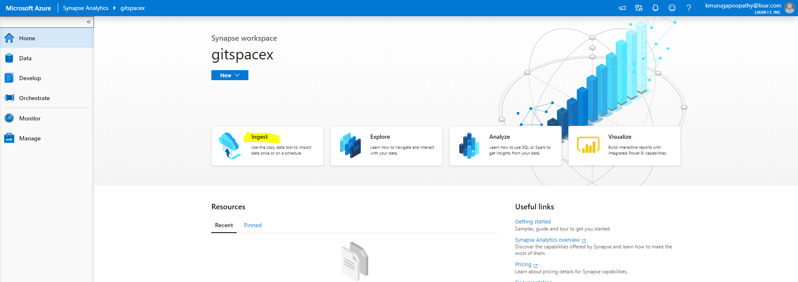

## Task 1 - Explore the data lake with Azure Synapse SQL On-demand

In this task, you will browse your data lake using SQL On-demand.

1. In a web browser, navigate to the Azure portal (`https://portal.azure.com`) and login with your credentials. Then select **Resource groups**.

    

2. Select the **Synapse Analytics** resource group.

3. Select the **Synapse Analytics** workspace.

4. On the Synapse workspace blade, open Synapse Analytics Studio by selecting **Launch Synapse Studio** from the toolbar.

   
   
5. In Synapse Analytics Studio, click 'Ingest'

  
  
6. In Ingest, input 'Task Name: LaunchPad' and select 'Run once now', click 'Next'

  

7. In Ingest, select '+ Create new connection', select 'REST' and 'Continue'

  

8. Enter 'https://api.spacexdata.com/v3/' as the 'Base URL' and 'Authorization Type' 'Anonymous'

  

9. Click 'Test Connection' to ensure connection is working, click 'Create'

  

10. In the 'Specify REST dataset properties' enter 'launchpads' as 'Relevant URL'. Click 'Preview' to view the load, enable 'Export as-is to JSON files or Cosmos DB collection'

  
  
11. In 'Destination data store' select '+ Create new connection', select 'Data Lake Gen2' and 'Continue'

    

12. For 'Authorization Method' select 'Account key' and navigate to your 'asadatalake01' created in setup, verify connection 

    

13. In 'Choose the output file or folder' for 'Folder path' it's recommended to use the following folder structure '/spacex/data/launchpads' File Name 'launchpads.json'

    

14. Click 'Next' in 'File format settings' ensure 'JSON Format' is selected

15. Click 'Next' in Summary. 

16. Deployment successful 

    
    

Repeat the following sets for:

Pipeline Name | Relevant URL
--- | ---
PastLaunches | `launches/past`
Payload | `payloads`
Rockets | `rockets`
