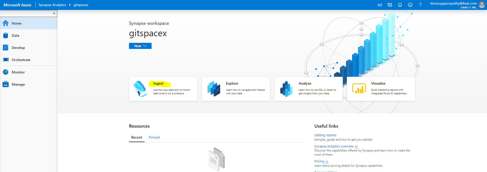
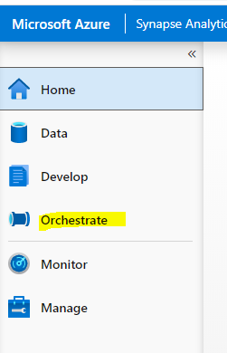
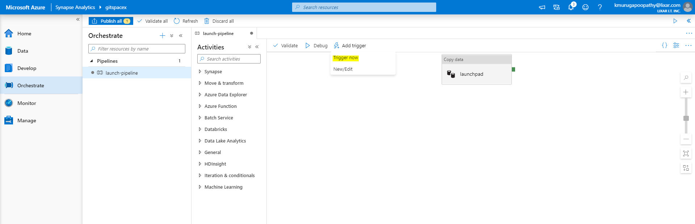
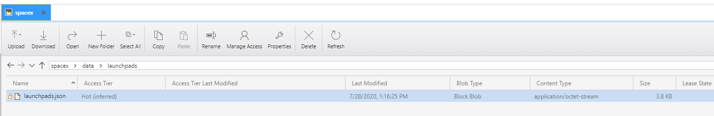

## Task 2 - Trigger Load

In this task, you will load the data into your data lake. Use Azure Storage Explore to verify ingestion

1. Select the **Synapse Analytics** resource group.

2. Select the **Synapse Analytics** workspace.

3. On the Synapse workspace blade, open Synapse Analytics Studio by selecting **Launch Synapse Studio** from the toolbar.

   
   
4. In 'Orchestrate', input 'Task Name: LaunchPad' and select 'Run once now', click 'Next'

  
  
5. Select 'Tigger now', click 'OK' to trigger

  
  
6. Verify file is created

  

------------------------------------------------------------------------------------
    

## Repeat steps #3-6 for following:

Pipeline Name | Relevant URL
--- | ---
PastLaunches | `launches/past`
Payload | `payloads`
Rockets | `rockets`
