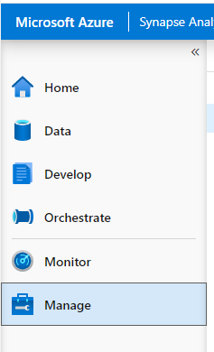
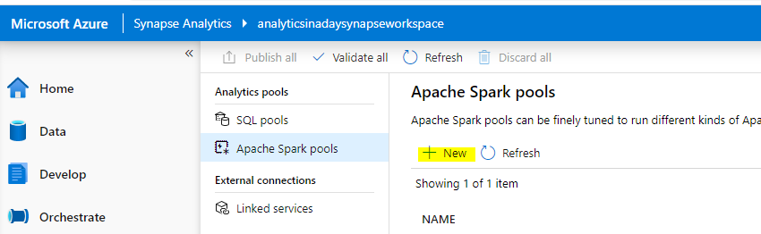
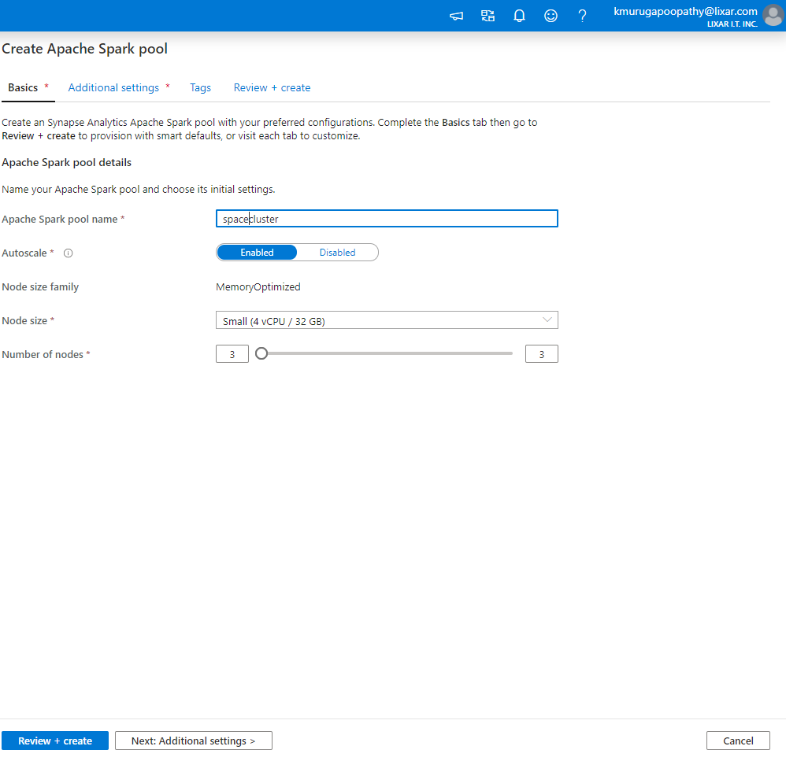
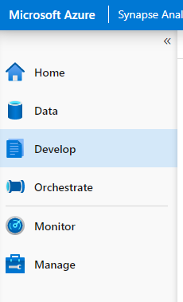
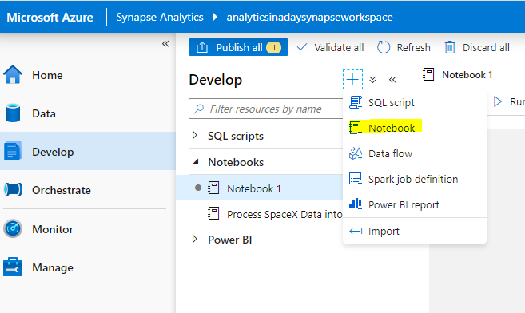

## Task 3 - Data Science with Apache Spark

Azure Synapse Analytics provides a unified environment for both data science and data engineering. What this means in practice, is that your data scientists can train and deploy models using Azure Synapse Analytics and your data engineers can write T-SQL queries that use those models to make predictions against tabular data stored in a SQL Pool database table.

In this exercise, you will leverage Apache Spark to write PySpark code to transform data

1. Select the **Synapse Analytics** resource group.

2. Select the **Synapse Analytics** workspace.

3. On the Synapse workspace blade, open Synapse Analytics Studio by selecting **Launch Synapse Studio** from the toolbar.
   
4. Click 'Manage'

  

5. Apache Spark Pool > New to create a new pool cluster

  

6. Input the following and click 'Create'

  
  
7. Click 'Develop'

   
   
8.  Create a Notebook

   

9. In put the following code:

   ```py
      import pyspark.sql
      
     ## Build dataframes from each API Method ##
      rockets_df = spark.read.json("/synapse/data/spacex/rockets/*.json")
      payloads_df = spark.read.json("/synapse/data/spacex/payloads/*.json")
      launchpads_df = spark.read.json("/synapse/data/spacex/launchpads/*.json")
      launches_df = spark.read.json("/synapse/data/spacex/launches/*.json")
   ```
   ```py
      rockets_df.registerTempTable( "rockets" )
      payloads_df.registerTempTable( "payloads" )
      launchpads_df.registerTempTable( "launchpads" )
      launches_df.registerTempTable( "launches" )
    ```
    ```py
      rockets_curated = spark.sql("   SELECT id, \
                                rocket_id, \
                                rocket_name, \
                                rocket_type, \
                                stages, \
                                success_rate_pct, \
                                wikipedia, \
                                active, \
                                boosters, \
                                company, \
                                cost_per_launch, \
                                diameter.meters as diameter_m, \
                                height.meters as height_m, \
                                mass.kg as mass_kg, \
                                first_stage.burn_time_sec as first_stage_burn_time_sec, \
                                first_stage.engines as first_stage_engines, \
                                first_stage.reusable as first_stage_reusable, \
                                second_stage.burn_time_sec as second_stage_burn_time_sec, \
                                second_stage.engines as second_stage_engines, \
                                second_stage.reusable as second_stage_reusable, \
                                flickr_images  \
                                FROM rockets")

      rockets_images = spark.sql("    SELECT id, \
                                img, \
                                row_number() OVER (Partition by id ORDER BY null) as ImageNumber \
                                FROM rockets \
                                lateral view explode(flickr_images) flickr_images as img ")
      display(rockets_curated)
     ```
     
 
    ```py
   payloads_curated = spark.sql("   SELECT uid, payload_id, payload_mass_kg, payload_type, reused, orbit, nationality, flight_time_sec, manufacturer FROM payloads")

   display(payloads_curated)
     ```

 
     ```py
      launchpads_curated = spark.sql("   SELECT id, \
                                    site_id, \
                                    site_name_long, \
                                    name, \
                                    status, \
                                    successful_launches, \
                                    location.latitude as loc_lat, \
                                    location.longitude as loc_long, \
                                    location.name as loc_name, \
                                    location.region as loc_region  \
                                    FROM launchpads")

      display(launchpads_curated)
     ```
     

     ```py
     launches_curated = spark.sql("   SELECT flight_number, \
                                  details, \
                                  is_tentative, \
                                  launch_date_local, \
                                  timestamp(launch_date_utc)  as launch_date_utc, \
                                  launch_success, \
                                  launch_year, \
                                  mission_id, \
                                  mission_name, \
                                  rocket.rocket_id, \
                                  rocket.rocket_name, \
                                  rocket.rocket_type, \
                                  upcoming, \
                                  launch_failure_details.reason as fail_reason, \
                                  launch_failure_details.altitude as fail_alt, \
                                  launch_failure_details.time as fail_time, \
                                  launch_site.site_id, \
                                  launch_site.site_name, \
                                  links.mission_patch_small \
                                  FROM launches ")

      display(launches_curated)
      ```

 
      ```py
      rockets_curated.write.mode("overwrite").saveAsTable("tblRockets")
      rockets_images.write.mode("overwrite").saveAsTable("tblRockets_Images")
      payloads_curated.write.mode("overwrite").saveAsTable("tblPayloads")
      launchpads_curated.write.mode("overwrite").saveAsTable("tblLaunchpads")
      launches_curated.write.mode("overwrite").saveAsTable("tblLaunches")
      ```
